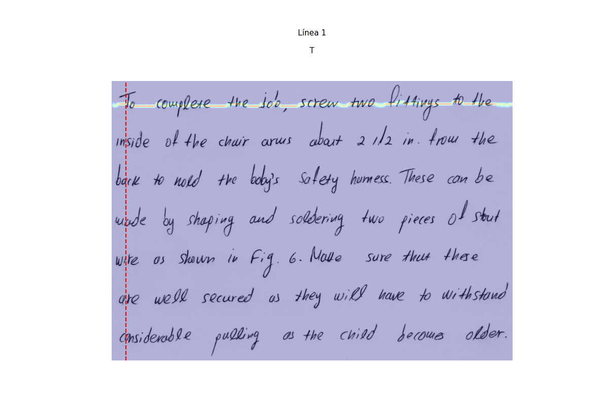
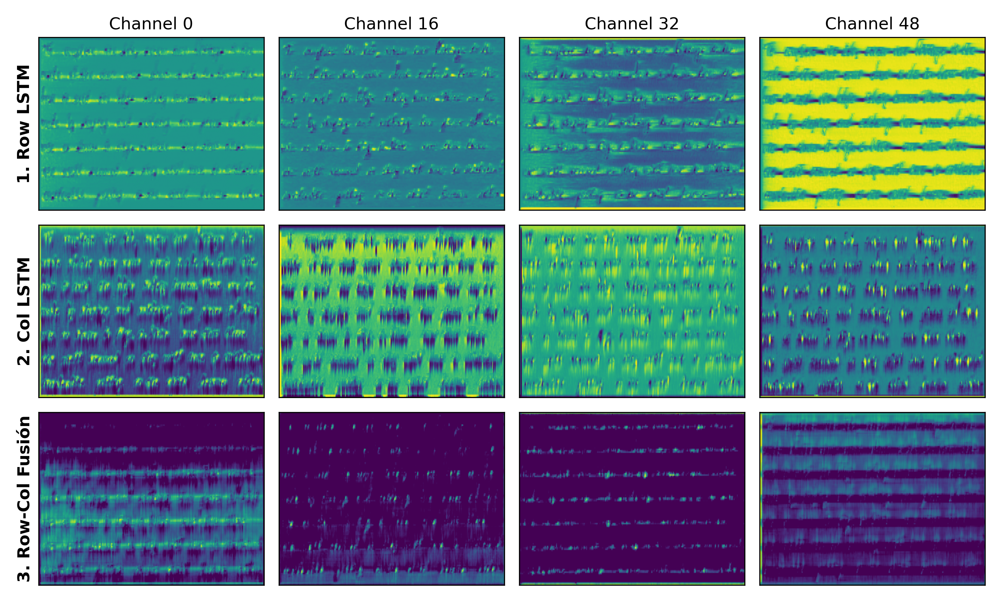

# Handwritten Text Recognition (HTR)

## 📖 Project Overview

This repository contains a complete, end-to-end Deep Learning pipeline for Handwritten Text Recognition (HTR). Built with PyTorch, the system is designed to read and transcribe unconstrained handwritten text ranging from single lines to full paragraphs (up to 13 lines).

The custom architecture solves the "vanishing gradient" and sequence-length problems typical in paragraph-level HTR by using a specialized attention mechanism. It combines a CNN for feature extraction, a `RowColLSTM` for spatial context, an `IterativeWeightedCollapse` module to dynamically isolate individual lines of text, and a Bidirectional LSTM decoder optimized with Connectionist Temporal Classification (CTC) Loss.

## 🗂️ Repository Structure

The project is modularized for easy maintenance and experimentation:

```text
Handwritten-Text-Recognition/
├── data/
│   ├── make_splits.py      # Generates image crops and splits data (Train/Val/Test)
│   └── dataset.py          # PyTorch Dataset (IAMParagraphDataset) and custom collate_fn
├── models/
│   ├── attention.py        # RowColLSTM and IterativeWeightedCollapse modules
│   └── htr_network.py      # The main FullParagraphHTR architecture
├── results/                # Stores inference outputs and visualizations
├── testing/
│   └── model_testing.ipynb # Jupyter notebook for evaluating and visualizing attention
├── utils/
│   └── metrics.py          # Vocabulary, JIWER metrics (CER/WER), and decoding logic
├── weights/                # Directory for saved .pth (training) and .pt (production) models
├── train.py                # Main training loop with Differential Learning Rates
├── .gitignore              # Ignores large datasets, weights, and caches
└── README.md               # Project documentation
```

## 🧠 Visualization & Model Interpretability

One of the core strengths of this custom architecture is its interpretability. By extracting and visualizing the intermediate states of the network, we can observe exactly how the model "reads" a document.

### Iterative Attention Mechanism



_The `IterativeWeightedCollapse` module in action. The heatmap shows the spatial attention mechanism successfully navigating the 2D canvas, isolating a single line of unconstrained handwritten text. By effectively ignoring large areas of blank padding and background noise, it perfectly crops the temporal sequence before passing it to the CTC decoder._

### Spatial Feature Maps



_Internal feature maps and activation channels from the CNN backbone and `RowColLSTM`. This visualization demonstrates how the network extracts structural patterns, stroke geometry, and spatial hierarchies from the raw image pixels prior to the attention phase._
